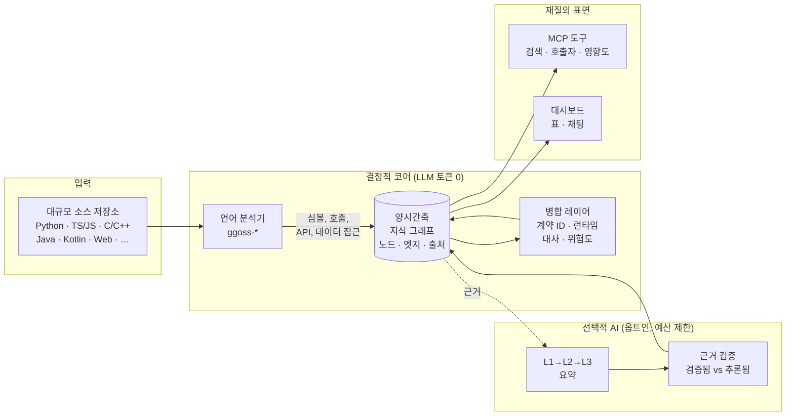
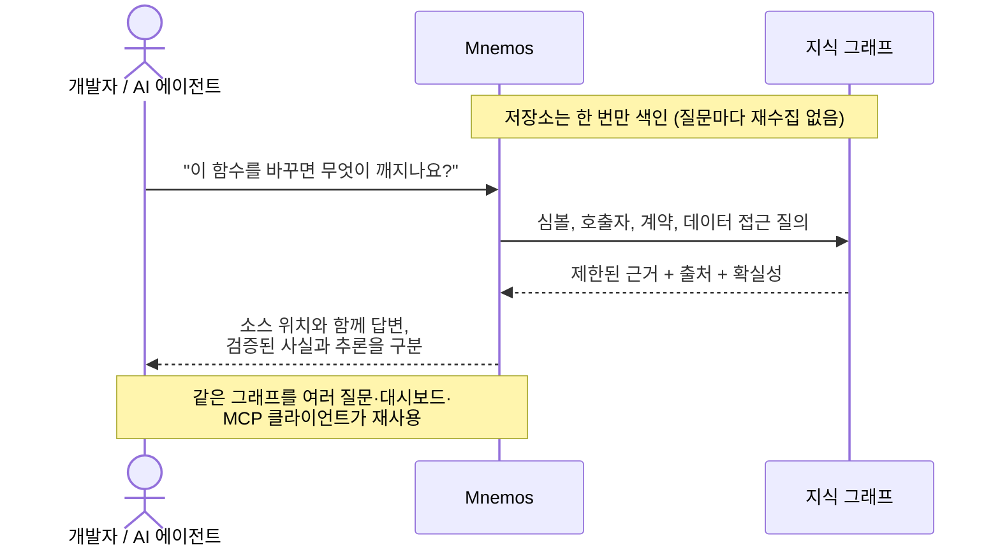

# Mnemos

[English](README.md) | 한국어

Mnemos는 **AI가 대규모 소스 코드를 더 빠르고 정확하게 이해하도록 돕는 분석 솔루션**입니다.

저장소 전체를 매번 AI에게 전달하는 대신, 소스 코드를 결정적으로 분석해 심볼과 관계를
색인하고 필요한 근거만 다시 조회할 수 있게 만듭니다. 개발자는 자연어 질문과 검색,
영향도 분석을 통해 복잡한 코드베이스를 탐색할 수 있고, AI 도구는 MCP를 통해 같은 분석
결과를 반복해서 활용할 수 있습니다.

Mnemos의 목적은 일반적인 챗봇이나 관리 시스템을 만드는 것이 아닙니다. 큰 소스
코드에서 필요한 사실을 찾고, 그 사실의 근거와 불확실성을 함께 제공하는 데 집중합니다.

> 현재 상태는 베타입니다. 핵심 색인과 조회 흐름은 테스트되었지만, 모든 언어 기능과
> 운영 환경에서의 완전한 분석을 보장하지는 않습니다.

## 왜 Mnemos가 필요한가

대규모 저장소를 AI가 직접 읽게 하면 다음과 같은 문제가 생깁니다.

- 저장소 전체가 AI의 컨텍스트 한도를 초과할 수 있습니다.
- 같은 질문을 할 때마다 많은 소스를 다시 읽어 토큰과 시간이 반복해서 소모됩니다.
- 답변이 실제 코드에 근거한 사실인지 AI의 추론인지 구분하기 어렵습니다.
- 서비스, API, 데이터 접근처럼 여러 파일에 걸친 변경 영향을 한 번에 파악하기 어렵습니다.
- 한 번 분석한 결과가 다음 작업에 재사용되지 않아 코드 이해 비용이 계속 발생합니다.

Mnemos는 소스를 먼저 색인하고, 질문에 필요한 범위만 작게 꺼내 주는 방식으로 이 문제를
해결합니다. 분석 결과에는 출처와 확실성 정보가 포함되며, 결정적 분석 결과와 AI가
추론한 내용을 구분합니다.

## 동작 방식

Mnemos는 먼저 결정적 색인 파이프라인을 실행하고, 사용자가 명시적으로 선택할 때만
LLM을 호출합니다. 기본 색인 과정은 토큰을 전혀 쓰지 않고 원본 소스를 다시 질의할 수
있는 지식 그래프로 변환합니다.



### 어떻게 사용되는가

AI 에이전트나 개발자가 질문하면, Mnemos는 저장소 전체를 다시 읽는 대신 그래프에서
근거가 뒷받침된 작은 조각만 골라 답합니다.



## 주요 기능

### 대규모 소스 색인

Python, TypeScript/JavaScript, C/C++, Java, Kotlin, Web 소스 등을 분석해 함수, 클래스,
호출, API, 데이터 접근과 같은 정보를 검색 가능한 형태로 저장합니다. 기본 색인은 LLM을
호출하지 않으므로 토큰 비용 없이 수행할 수 있습니다.

### 근거 중심의 코드 탐색

심볼 검색, 호출자·피호출자 조회, 변경 영향 분석, API 계약 및 데이터 접근 조회를
제공합니다. 결과는 가능한 경우 파일과 소스 위치, 관계, 확실성 정보를 함께 보여 줍니다.

### AI 질문과 재조회

대시보드의 Ask 기능 또는 MCP 도구를 이용해 다음과 같은 질문을 할 수 있습니다.

- 결제 실패 재시도 로직은 어디에 있는가?
- 이 함수를 변경하면 어떤 코드가 영향을 받는가?
- 특정 API를 호출하는 클라이언트는 무엇인가?
- 이 테이블을 읽거나 수정하는 코드는 어디에 있는가?
- 특정 기능이 실행되는 주요 호출 흐름은 무엇인가?

AI는 저장소 전체를 다시 읽는 대신 Mnemos가 제공하는 제한된 근거를 조회해 답변을
구성할 수 있습니다.

### 변경 이력과 분석 결과 재사용

분석 결과는 시점 정보를 가진 지식 그래프로 유지됩니다. 같은 내용의 저장소를 다시
분석할 때 불필요한 작업을 줄이고, 변경된 코드에 맞춰 현재 결과를 갱신할 수 있습니다.

### 선택적 AI 설명

필요한 경우 함수, 파일, 모듈 단위 설명을 선택적으로 생성할 수 있습니다. 이 기능은
결정적 색인과 분리되어 있으며, 명시적으로 활성화할 때만 제한된 예산 안에서 동작합니다.
AI 설명은 소스의 확정 사실을 덮어쓰지 않습니다.

## 장점

### 1. 컨텍스트와 토큰 사용 절감

전체 저장소를 질문마다 프롬프트에 넣지 않고, 관련 심볼과 관계만 선별해 제공합니다.
일반적인 전체 색인은 LLM 없이 수행되며, 선택적 AI 기능에도 입력·출력·호출 횟수와
실행 시간 제한이 적용됩니다.

### 2. 반복 분석 시간 단축

한 번 만든 색인을 여러 질문과 여러 AI 작업에서 재사용합니다. 변경되지 않은 분석
대상은 다시 처리하지 않아 대규모 저장소의 반복 탐색 비용을 줄입니다.

### 3. 답변 신뢰도 향상

분석 결과가 실제 그래프에 존재하는 소스 근거와 연결되는지 검증합니다. 확인된 사실과
추론된 내용을 구분하므로, 사용자는 답변을 어디까지 신뢰하고 어디를 직접 확인해야
하는지 판단하기 쉽습니다.

### 4. 변경 영향 파악

호출 관계, API 계약, 데이터 접근, 런타임 관측 정보를 함께 조회해 한 파일만 읽어서는
놓치기 쉬운 변경 범위를 찾을 수 있습니다.

### 5. 팀과 AI 도구 간 지식 재사용

분석 결과를 대시보드와 MCP에서 공통으로 사용할 수 있습니다. 특정 개발자나 한 번의
AI 세션에만 남던 코드 이해를 지속적으로 다시 조회할 수 있는 자산으로 전환합니다.

## 실제 측정 성능

다음 결과는 2026년 7월 16일에 수행한 재현 가능한 PostgreSQL 컴포넌트 soak
측정값입니다. 테스트 환경은 Windows 11 Pro, Intel i5-1340P(논리 프로세서 16개),
메모리 약 31.7 GiB, Python 3.12.12, PostgreSQL 17.10입니다.

합성 코퍼스는 100개 디렉터리의 Python 파일 50,000개로 구성했으며, 파일마다 함수
하나를 포함합니다. 전체 크기는 약 100,000 LOC와 1.89 MB이고, 분석기 큐 상한은
64레코드, 데이터베이스 배치 크기는 50입니다.

| 측정 항목 | 실측 결과 |
|---|---:|
| 최초 분석기 실행 및 스테이징 | 152.836초, 초당 327.147레코드 |
| 최초 원자적 게시 | 65.945초, 노드 50,000개 삽입 |
| 동일 콘텐츠 분석기 실행 및 스테이징 | 125.987초, 초당 396.865레코드 |
| 동일 콘텐츠 원자적 게시 | 11.355초, 노드 50,000개 unchanged |
| 동일 콘텐츠 전체 갱신 | 137.387초, semantic no-op |
| 메모리에 유지된 최대 후보 수 | 50개 |
| 표본 측정 최대 RSS | 약 106.0 MiB |
| LLM 사용량 | 호출 0회, 입력·출력 토큰 0 |

최대 RSS는 벤치마크 컨트롤러와 직접 실행한 분석기 자식 프로세스의 표본 측정값이며
PostgreSQL 서버 메모리는 포함하지 않습니다. 이 결과는 컴포넌트 측정값이지 운영 환경의
처리 용량을 보장하는 수치가 아닙니다. 코퍼스에는 그래프 엣지가 없었고, 다중 언어,
Git checkout, Redis, HTTP/MCP 질의, 호출·계약·데이터 접근 추출, 선택적 LLM 워크플로는
측정 범위에 포함되지 않았습니다.

실행 명령, 전체 측정값과 한계는
[전체 성능 리포트](docs/04-eval/speed-token-root-design-2026-07-16.md#4-실제-postgresql-50k-component-soak)와
[원본 벤치마크 결과](docs/04-eval/evidence/postgres-50k-soak-2026-07-16.json)를
참고하세요.

## 빠르게 시작하기

### 요구 사항

- Python 3.12 이상
- Git
- Docker Compose 방식 사용 시 Docker

### 로컬 모드

외부 데이터베이스나 Redis 없이 Mnemos를 체험할 수 있는 가장 간단한 방법입니다.
SQLite, 인프로세스 작업 큐, 저장소에 포함된 분석기를 사용합니다.

```bash
git clone <Mnemos 저장소 URL>
cd Mnemos/server
pip install -e ".[local]"
python -m app.serve_local --seed-demo
```

실행 로그에 표시되는 데모 계정 정보를 확인한 뒤
`http://localhost:16401/login`에 접속합니다.

### Docker Compose

지속적인 분석과 운영에 가까운 환경은 Docker Compose로 실행할 수 있습니다.

```bash
git clone <Mnemos 저장소 URL>
cd Mnemos
cp .env.example .env
```

분석할 저장소의 절대 경로를 `.env`에 설정합니다.

```env
MNEMOS_SOURCE_ROOT=/absolute/path/to/source-repo
```

세션과 비밀 정보 보호에 사용할 값을 생성해 `.env`에 추가합니다.

```bash
python -c "from cryptography.fernet import Fernet; print('FERNET_KEY=' + Fernet.generate_key().decode())"
python -c "import secrets; print('SECRET_KEY=' + secrets.token_urlsafe(48))"
```

출력된 두 값을 `.env`에 저장한 다음 서비스를 시작합니다.

```bash
docker compose up -d --build
docker compose exec platform alembic upgrade head
docker compose exec platform python -m app.cli create-user --username admin --role admin
```

준비 상태를 확인하고 로그인합니다.

```bash
curl -f http://localhost:16401/api/v1/health
curl -f http://localhost:16401/api/v1/health/ready
```

접속 주소는 `http://localhost:16401/login`입니다.

## 기본 사용 방법

1. **프로젝트 등록**
   대시보드에서 분석할 프로젝트를 만들고 저장소 정보를 입력합니다.

2. **소스 분석 실행**
   Analysis 화면에서 분석할 Git 리비전과 소스 경로를 선택합니다. Docker Compose의
   기본 마운트 경로는 `/work`입니다. 처음에는 AI 요약을 끄고 기본 색인부터 실행하는
   것을 권장합니다.

3. **분석 결과 확인**
   심볼, 호출 관계, API, 데이터 접근, 발견 항목을 검색해 코드베이스의 주요 동작을
   확인합니다. 결과의 근거 위치와 확실성도 함께 살펴봅니다.

4. **질문하기**
   Ask 화면에서 기능 위치, 호출 흐름, 변경 영향 등을 자연어로 질문합니다. 더 정확한
   답이 필요하면 범위를 함수, 파일 또는 모듈 단위로 좁혀 질문합니다.

5. **AI 도구에서 재사용**
   MCP를 지원하는 AI 개발 도구에 Mnemos MCP 서버를 등록하면 동일한 색인을 심볼 검색,
   호출 관계 조회, 영향도 분석 등에 사용할 수 있습니다.

자세한 첫 실행 절차는
[시작 가이드](docs/operator-guide/getting-started.md), 배포와 운영 설정은
[운영 가이드](docs/operator-guide/deployment.md)를 참고하세요.

## 효과적으로 사용하는 방법

- 먼저 LLM 없는 기본 색인을 완료한 뒤 필요한 영역에만 AI 설명을 사용하세요.
- 넓은 질문보다 기능명, 심볼명, API 경로, 테이블명을 포함한 질문이 더 정확합니다.
- `verified`, `asserted`, `inferred`와 같은 확실성 표시를 확인하세요.
- 변경 전에는 영향도 분석으로 호출자, 피호출자, 계약, 데이터 접근 범위를 함께
  확인하세요.
- 분석기가 지원하지 않는 언어 기능이나 동적 호출은 결과에서 누락될 수 있으므로,
  중요한 변경은 표시된 소스 근거를 직접 검토하세요.

## 지원 범위와 한계

- 기본 분석기는 Python, TypeScript/JavaScript, C/C++, Java, Kotlin, Web 및 선택적
  tree-sitter 언어 분석을 제공합니다.
- C#, MSSQL/Oracle, .NET 바이너리 분석기는 저장소에 포함되어 있지만 기본 Compose
  worker 실행 경로에는 포함되지 않습니다.
- 동적 호출, 전처리기 조건, 일부 언어의 완전한 이름 해석은 제한적일 수 있습니다.
- 선택적 AI 설명은 추론 결과이며 결정적 분석 사실과 동일하게 취급되지 않습니다.
- 라이브 LLM 제공자와 일부 운영 시나리오는 환경별 추가 검증이 필요합니다.

Mnemos는 분석 결과를 무조건 완전하다고 주장하지 않습니다. 지원되지 않거나 확인되지
않은 영역을 드러내고, 사용자가 근거를 따라가며 판단할 수 있도록 돕는 것을 우선합니다.

## 개발 및 테스트

```bash
cd server
pytest -m "not integration"
ruff check .
```

전체 통합 테스트는 각 테스트가 요구하는 PostgreSQL, Redis 등의 외부 서비스를
준비해야 합니다.

## 라이선스

[LICENSE](LICENSE)를 참고하세요.
