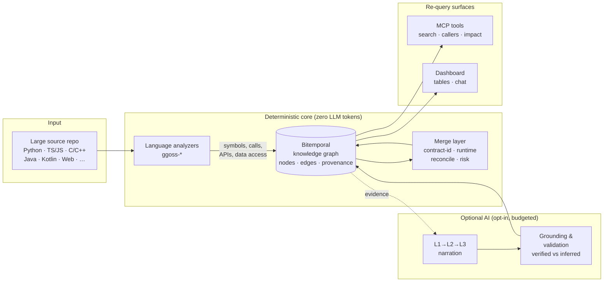
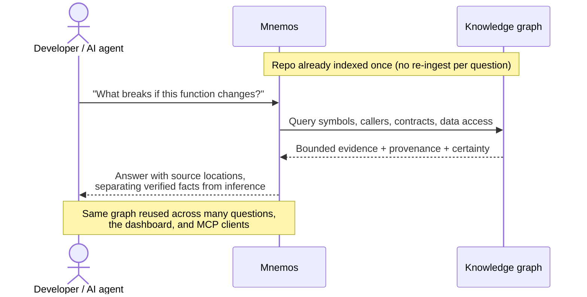

# Mnemos

English | [한국어](README.ko.md)

Mnemos is a **source analysis solution that helps AI understand large codebases
faster and more accurately**.

Instead of sending an entire repository to an AI for every task, Mnemos
deterministically analyzes the source, indexes symbols and relationships, and
makes the relevant evidence available for targeted re-query. Developers can
explore complex codebases through natural-language questions, search, and
impact analysis, while AI tools can reuse the same analysis through MCP.

Mnemos is not a general-purpose chatbot or administration platform. It focuses
on finding facts in large codebases and presenting those facts together with
their evidence and uncertainty.

> Mnemos is currently in beta. Its core indexing and query workflows are
> tested, but complete analysis is not guaranteed for every language feature
> or operating environment.

## Why Mnemos?

Asking an AI to read a large repository directly creates several problems:

- The repository may exceed the AI model's context window.
- Re-reading the same source for every question repeatedly consumes time and
  tokens.
- It is difficult to distinguish source-backed facts from AI inference.
- Changes that span files, services, APIs, and data access paths are difficult
  to assess at once.
- Knowledge from one analysis session is not automatically reusable in the
  next.

Mnemos addresses these problems by indexing source code first and retrieving
only the small evidence set needed for each question. Results include source
provenance and certainty information, keeping deterministic findings separate
from AI-generated inference.

## How It Works

Mnemos runs a deterministic indexing pipeline first and only calls an LLM when
you explicitly opt in. The default pass turns raw source into a re-queryable
knowledge graph without spending any tokens.



### How it is used

An AI agent or a developer asks a question, and Mnemos answers from the small,
evidence-backed slice of the graph instead of re-reading the whole repository.



## Key Features

### Large-scale source indexing

Mnemos analyzes Python, TypeScript/JavaScript, C/C++, Java, Kotlin, Web, and
other supported source files. It stores functions, classes, calls, APIs, and
data access information in a searchable form. The default indexing pass does
not call an LLM, so it uses no LLM tokens.

### Evidence-grounded code exploration

Search symbols, inspect callers and callees, analyze change impact, and query
API contracts or data access. Where available, results include file locations,
source positions, relationships, and certainty.

### AI-assisted questions and re-query

Use the Ask view or MCP tools to investigate questions such as:

- Where is the retry logic for failed payments?
- What code is affected if this function changes?
- Which clients call this API?
- Where is this table read or modified?
- What is the primary execution path for this feature?

Instead of re-reading the whole repository, an AI can build its answer from the
bounded evidence supplied by Mnemos.

### Reusable analysis with change history

Analysis results are stored in a time-aware knowledge graph. Mnemos can avoid
unnecessary work when the same repository content is analyzed again and update
the current view as the code changes.

### Optional AI explanations

Mnemos can optionally generate function-, file-, and module-level explanations.
This step is separate from deterministic indexing, runs only when explicitly
enabled, and operates within bounded budgets. AI explanations never override
source facts.

## Benefits

### 1. Lower context and token usage

Mnemos selects relevant symbols and relationships instead of placing the whole
repository in every prompt. Normal indexing runs without an LLM, and optional
AI features enforce input, output, call-count, and wall-time limits.

### 2. Faster repeated analysis

A single index can support many questions and AI tasks. Unchanged analysis
targets are skipped, reducing repeated work in large repositories.

### 3. More trustworthy answers

Mnemos validates whether structured results are backed by evidence in the
current project graph. By separating verified or asserted findings from
inference, it makes clear what can be trusted and what should be checked
manually.

### 4. Better change-impact visibility

Call relationships, API contracts, data access, and runtime observations can be
queried together, revealing impact that may be missed when reviewing one file
at a time.

### 5. Reusable knowledge for teams and AI tools

The dashboard and MCP clients use the same analysis results. Code understanding
that would otherwise remain with one developer or one AI session becomes a
durable, re-queryable resource.

## Measured Performance

The following results come from the reproducible PostgreSQL component soak
performed on July 16, 2026. The test machine ran Windows 11 Pro on an Intel
i5-1340P with 16 logical processors and approximately 31.7 GiB of RAM, using
Python 3.12.12 and PostgreSQL 17.10.

The synthetic corpus contained 50,000 Python files across 100 directories, with
one function per file: approximately 100,000 lines of code and 1.89 MB of source.
The analyzer used a queue limit of 64 records and database batches of 50.

| Measurement | Observed result |
|---|---:|
| Initial analyzer and staging | 152.836 s; 327.147 records/s |
| Initial atomic publication | 65.945 s; 50,000 nodes inserted |
| Same-content analyzer and staging | 125.987 s; 396.865 records/s |
| Same-content atomic publication | 11.355 s; 50,000 nodes unchanged |
| Complete same-content refresh | 137.387 s; semantic no-op |
| Maximum buffered candidates | 50 |
| Sampled peak RSS | approximately 106.0 MiB |
| LLM usage | 0 calls; 0 input and output tokens |

The peak RSS measurement covers the benchmark controller and its direct
analyzer child; it does not include the PostgreSQL server. This is a component
measurement, not a production capacity claim. The corpus had no graph edges and
did not exercise mixed languages, Git checkout, Redis, HTTP/MCP queries,
calls/contracts/data-access extraction, or optional LLM workflows.

See the
[full performance report](docs/04-eval/speed-token-root-design-2026-07-16.md#4-실제-postgresql-50k-component-soak)
and the
[raw benchmark artifact](docs/04-eval/evidence/postgres-50k-soak-2026-07-16.json)
for the command, complete measurements, and limitations.

## Quick Start

### Requirements

- Python 3.12 or later
- Git
- Docker, when using the Docker Compose setup

### Local mode

Local mode is the simplest way to try Mnemos without an external database or
Redis. It uses SQLite, an in-process job queue, and the analyzers included in
the repository.

```bash
git clone <Mnemos repository URL>
cd Mnemos/server
pip install -e ".[local]"
python -m app.serve_local --seed-demo
```

Use the demo credentials shown in the startup log, then open
`http://localhost:16401/login`.

### Docker Compose

Use Docker Compose for persistent analysis and an environment closer to an
operational deployment.

```bash
git clone <Mnemos repository URL>
cd Mnemos
cp .env.example .env
```

Set the absolute path of the repository to analyze in `.env`:

```env
MNEMOS_SOURCE_ROOT=/absolute/path/to/source-repo
```

Generate values used to protect sessions and stored secrets:

```bash
python -c "from cryptography.fernet import Fernet; print('FERNET_KEY=' + Fernet.generate_key().decode())"
python -c "import secrets; print('SECRET_KEY=' + secrets.token_urlsafe(48))"
```

Add both generated values to `.env`, then start the services:

```bash
docker compose up -d --build
docker compose exec platform alembic upgrade head
docker compose exec platform python -m app.cli create-user --username admin --role admin
```

Check service readiness:

```bash
curl -f http://localhost:16401/api/v1/health
curl -f http://localhost:16401/api/v1/health/ready
```

Open `http://localhost:16401/login` to sign in.

## Basic Usage

1. **Register a project**
   Create a project from the dashboard and enter its repository information.

2. **Run source analysis**
   In the Analysis view, select the Git revision and source path. The default
   Docker Compose mount path is `/work`. Start with AI summaries disabled and
   run deterministic indexing first.

3. **Review the results**
   Search symbols, call relationships, APIs, data access, and findings to
   understand the codebase. Review the evidence location and certainty shown
   with each result.

4. **Ask questions**
   Use the Ask view to investigate feature locations, execution paths, and
   change impact. Narrowing the question to a function, file, or module usually
   produces a more precise result.

5. **Reuse the index from AI tools**
   Connect the Mnemos MCP server to an MCP-compatible AI development tool to
   reuse the index for symbol search, call traversal, and impact analysis.

For a guided first session, see the
[getting started guide](docs/operator-guide/getting-started.md). For deployment
and operations, see the
[deployment guide](docs/operator-guide/deployment.md).

## Usage Tips

- Complete deterministic indexing before enabling AI explanations for selected
  areas.
- Include a feature name, symbol, API path, or table name instead of asking an
  overly broad question.
- Check certainty labels such as `verified`, `asserted`, and `inferred`.
- Before changing code, inspect callers, callees, contracts, and data access
  together.
- Dynamic behavior and unsupported language features may be absent from the
  results. Review the referenced source directly before making a critical
  change.

## Supported Scope and Limitations

- The default analyzers cover Python, TypeScript/JavaScript, C/C++, Java,
  Kotlin, Web, and optional tree-sitter languages.
- C#, MSSQL/Oracle, and .NET binary analyzers are included in the repository
  but are not wired into the default Compose worker path.
- Dynamic calls, preprocessor conditions, and complete name resolution in some
  languages remain limited.
- Optional AI explanations are inferred results and are not equivalent to
  deterministic source facts.
- Live LLM providers and some operational scenarios require additional
  environment-specific validation.

Mnemos does not claim that every analysis result is complete. Its priority is
to expose unsupported or unverified areas and help users follow the evidence to
make informed decisions.

## Development and Testing

```bash
cd server
pytest -m "not integration"
ruff check .
```

The full integration suite requires the external services declared by each
test, such as PostgreSQL and Redis.

## License

See [LICENSE](LICENSE).
